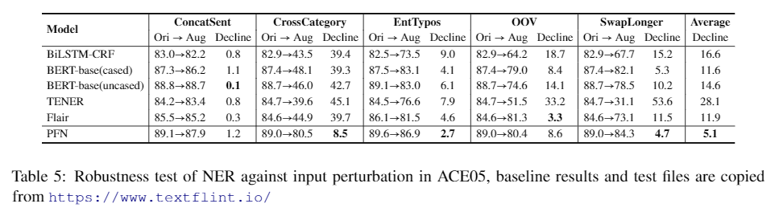

# PFN (Partition Filter Network)
This repository contains codes of the official implementation for the paper **A Partition Filter Network for Joint Entity and Relation Extraction** EMNLP 2021 [[PDF]](https://arxiv.org/pdf/2108.12202.pdf) [[PPT]](https://docs.google.com/presentation/d/1CiHWBdwoQexY0JgSP_JxC-QFciZBmTGo/edit?usp=sharing&ouid=107947850659680847257&rtpof=true&sd=true)

## Quick links
* [Model Overview](#Model-Overview)
* [Preparation](#Preparation)
  * [Environment Setup](#Environment-setup)
  * [Data Acquisition and Preprocessing](#Data-Acquisition-and-Preprocessing)
  * [Custom Dataset](#Custom-Dataset)
* [Quick Start](#Quick-Start)
  * [Model Training](#Model-Training)
  * [Evaluation on Pre-trained Model](#Evaluation-on-Pre-trained-Model)
  * [Inference on Customized Input](#Inference-on-Customized-Input)
* [Evaluation on CoNLL04](#Evaluation-on-CoNLL04)
* [Pre-trained Models and Training Logs](#Pre-trained-Models-and-Training-Logs)
  * [Download Links](#Download-Links)
  * [Result Display](#Result-Display)
* [Robustness Against Input Perturbation](#Robustness-Against-Input-Perturbation)
* [Citation](#Citation)
* [Questions and Notes](#Questions-and-Notes)


## Model Overview

In this work, we present a new framework equipped with a novel recurrent encoder named **partition
filter encoder** designed for multi-task learning. The encoder enforces bilateral interaction between NER and RE in two ways:
1. The shared partition represents inter-task information and is equally accessible to both tasks, allowing for balanced interaction between NER and RE.  
2. The task partitions represent intra-task information and are formed through concerted efforts of entity and relation gates, making sure that encoding process of entity and relation features are dependent upon each other.


## Preparation

### Environment Setup
The experiments were performed using one single NVIDIA-RTX3090 GPU. The dependency packages can be installed with the following command:
```
pip install -r requirements.txt
```
Also, make sure that the python version is 3.7.10

### Data Acquisition and Preprocessing
We evaluate our model on seven datasets: [**NYT**, **WEBNLG**, **ADE**, **ACE2005**, **ACE2004**, **SCIERC**, **CONLL04**]. Please follow the instructions of reademe.md in each dataset folder in ./data/ for data acquisition and preprocessing.  

### Custom Dataset 
If your custom dataset has a large number of triples that contain head-overlap entities, the model accuracy will not be good.  

The model will not be able to distinguish entities that overlaps in head tokens in relation extraction. For example, if **New York** and **New York City** are both entities, and there exists a RE prediction such as (new, cityof, USA), we cannot know what **New** corresponds to.  

Luckily, the impact on model evaluation is limited, since such triple is either filtered out (for ADE) or rare (one in test set of SciERC, one in ACE04, zero in other datasets).    

Currently you can add a new tail-to-tail prediction in the RE unit to cover this case, but metric evaluation, data processing and such require modification as well. We will update a new version of PFN to handle the issue in the near future.


## Quick Start


### Model Training
The training command-line is listed below (command for CONLL04 is in [Evaluation on CoNLL04](#Evaluation-on-CoNLL04)):  
```
python main.py \
--data ${NYT/WEBNLG/ADE/ACE2005/ACE2004/SCIERC} \
--do_train \
--do_eval \
--embed_mode ${bert_cased/albert/scibert} \
--batch_size ${20 (for most datasets) /4 (for SCIERC)} \
--lr ${0.00002 (for most datasets) /0.00001 (for SCIERC)} \
--output_file ${the name of your output files, e.g. ace_test} \
--eval_metric ${micro/macro} 
```

After training, you will obtain three files in the ./save/${output_file}/ directory:     
  * **${output_file}.log** records the logging information.  
  * **${output_file}.txt** records loss, NER and RE results of dev set and test set for each epoch.  
  * **${output_file}.pt** is the saved model with best average F1 results of NER and RE in the dev set.  


### Evaluation on Pre-trained Model

The evaluation command-line is listed as follows:

```
python eval.py \
--data ${NYT/WEBNLG/ADE/ACE2005/ACE2004/SCIERC} \
--eval_metric ${micro/macro} \
--model_file ${the path of saved model you want to evaluate. e.g. save/ace_test.pt} \
--embed_mode ${bert_cased/albert/scibert}
```

### Inference on Customized Input

If you want to evaluate the model with customized input, please run the following code:  

```
python inference.py \
--model_file ${the path of your saved model} \
--sent ${sentence you want to evaluate, str type restricted}
```
   
{model_file} must contain information about the datasets the model trained on (web/nyt/ade/ace/sci) and the type of pretrained embedding the model uses (albert/bert/scibert). For example, model_file could be set as "web_bert.pt"  
 
  
#### Example
```
input:
python inference.py \
--model_file save/sci_test_scibert.pt \
--sent "In this work , we present a new framework equipped with a novel recurrent encoder   
        named partition filter encoder designed for multi-task learning ."

result:
entity_name: framework, entity type: Generic
entity_name: recurrent encoder, entity type: Method
entity_name: partition filter encoder, entity type: Method
entity_name: multi-task learning, entity type: Task
triple: recurrent encoder, Used-for, framework
triple: recurrent encoder, Part-of, framework
triple: recurrent encoder, Used-for, multi-task learning
triple: partition filter encoder, Hyponym-of, recurrent encoder
triple: partition filter encoder, Used-for, multi-task learning


input:  
python inference.py \
--model_file save/ace_test_albert.pt \
--sent "As Williams was struggling to gain production and an audience for his work in the late 1930s ,  
        he worked at a string of menial jobs that included a stint as caretaker on a chicken ranch in   
        Laguna Beach , California . In 1939 , with the help of his agent Audrey Wood , Williams was 
        awarded a $1,000 grant from the Rockefeller Foundation in recognition of his play Battle of 
        Angels . It was produced in Boston in 1940 and was poorly received ."

result:
entity_name: Williams, entity type: PER
entity_name: audience, entity type: PER
entity_name: his, entity type: PER
entity_name: he, entity type: PER
entity_name: caretaker, entity type: PER
entity_name: ranch, entity type: FAC
entity_name: Laguna Beach, entity type: GPE
entity_name: California, entity type: GPE
entity_name: his, entity type: PER
entity_name: agent, entity type: PER
entity_name: Audrey Wood, entity type: PER
entity_name: Williams, entity type: PER
entity_name: Rockefeller Foundation, entity type: ORG
entity_name: his, entity type: PER
entity_name: Boston, entity type: GPE
triple: caretaker, PHYS, ranch
triple: ranch, PART-WHOLE, Laguna Beach
triple: Laguna Beach, PART-WHOLE, California
```


## Evaluation on CoNLL04
We also run the test on the dataset CoNLL04, but we did not report the results in our paper due to several reasons:  
* We are unsure that the baseline results are fairly reported, the problems are discussed in detail in [Let's Stop Incorrect Comparisons in End-to-end Relation Extraction!](https://arxiv.org/pdf/2009.10684.pdf) 
* Hyper-parameter tuning affects the performance considerably in this dataset.
* Page limits


The command for running CoNLL04 is listed below:

```
python main.py \
--data CONLL04 \
--do_train \
--do_eval \
--embed_mode albert \
--batch_size 10 \
--lr 0.00002 \
--output_file ${the name of your output files} \
--eval_metric micro \
--clip 1.0 \
--epoch 200
```


## Pre-trained Models and Training Logs

We provide you with pre-trained models for NYT/WEBNLG/ACE2005/ACE2004/SCIERC/CONLL04, along with recorded results of each epoch, identical with training results under the specified configurations above.  


### Download Links
Due to limited space in google drive, 10-fold model files for ADE are not available to you (training record still available).  

After downloading the linked files below, unzip them and put **${data}_test.pt** in the directory of ./save/ before running eval.py.
Also, **${data}_test.txt** and **${data}_test.log** records the results of each epoch. You should check that out as well.  

| Dataset               |  File Size | Embedding          | Download                                                                                   |
| --------------------- |  --------- | ----------------   | ------------------------------------------------------------------------------------------ |
| **NYT**               |  393MB     | Bert-base-cased    | [Link](https://drive.google.com/file/d/1hyLDruvg6qBhveGWZQEzJ9_LCDPbLpLw/view?usp=sharing) |
| **WebNLG**            |  393MB     | Bert-base-cased    | [Link](https://drive.google.com/file/d/1Tdw6TYgVKlKbnbKAXyOPBgWbEeXnim3Q/view?usp=sharing) |
| **ACE05**             |  815MB     | Albert-xxlarge-v1  | [Link](https://drive.google.com/file/d/17HcLawF23rZEhWl-6QtN9hg8HMvR4Imf/view?usp=sharing) |
| **ACE04**             |  3.98GB    | Albert-xxlarge-v1  | [Link](https://drive.google.com/file/d/1ViTsEvprcouGozdVqZahtgtg1WNzvQci/view?usp=sharing) |
| **SciERC**            |  399MB     | Scibert-uncased    | [Link](https://drive.google.com/file/d/1KsWRstdhrX0IDpnDqFUi6NAlnlmzlekI/view?usp=sharing) |
| **ADE**               |  214KB     | Bert + Albert      | [Link](https://drive.google.com/file/d/1LexnMMNHY50nLdLku6V8_L_0BBLABVOA/view?usp=sharing) |
| **CoNLL04**           |  815MB     | Albert-xxlarge-v1  | [Link](https://drive.google.com/file/d/1vUqNxck8zYqD63tzcH8-d54iHnB0ZO8-/view?usp=sharing) |

### Result Display
F1 results on NYT/WebNLG/ACE05/SciERC:
| Dataset    |  Embedding          | NER       | RE        |
| ---------- |  ---------          | --------- | --------- |
| **NYT**    |  Bert-base-cased    | 95.8      | 92.4      |
| **WebNLG** |  Bert-base-cased    | 98.0      | 93.6      |
| **ACE05**  |  Albert-xxlarge-v1  | 89.0      | 66.8      |
| **SciERC** |  Scibert-uncased    | 66.8      | 38.4      |


F1 results on ACE04:
| 5-fold     |  0    |  1  | 2   | 3     |  4      | Average |
| ---------- |  ---- |---- |---- |------ | ------- | ------- |
| Albert-NER |  89.7 |89.9 |89.5 |89.7   |  87.6   | 89.3    |
| Albert-RE  |  65.5 |61.4 |63.4 |61.5   |  60.7   | 62.5    |

F1 results on CoNLL04:
| Model         |  Embedding          | Micro-NER | Micro-RE |
| ------------- |  ---------          | --------- | ---------|
| Table-sequence|  Albert-xxlarge-v1  | 90.1      | 73.6     |
| PFN           |  Albert-xxlarge-v1  | 89.6      | 75.0     |

F1 results on ADE:
| 10-fold     |  0    |  1  | 2   | 3     |  4      | 5  | 6  | 7  | 8  | 9  | Average |
| -------     | ------|-----|-----|------ |---------|----|----|----|----|----| ------- |
| Bert-NER    |  89.6 |92.3 |90.3 |88.9   |  88.8   |90.2|90.1|88.5|88.0|88.9| 89.6    |
| Bert-RE     |  80.5 |85.8 |79.9 |79.4   |  79.3   |80.5|80.0|78.1|76.2|79.8| 80.0    |
| Albert-NER  |  91.4 |92.9 |91.9 |91.5   |  90.7   |91.6|91.9|89.9|90.6|90.7| 91.3    |
| Albert-RE   |  83.9 |86.8 |82.8 |83.2   |  82.2   |82.4|84.5|82.3|81.9|82.2| 83.2    |


## Robustness Against Input Perturbation


We use robustness test to evaluate our model under adverse circumstances. In this case, we use the domain transformation methods of NER from [Textflint](https://www.textflint.io/textflint).   

The test files can be found in the folder of ./robustness_data/.  Our reported results are evaluated with the linked **ACE2005-albert** model above. For each test file, move it to ./data/ACE2005/ and rename it as **test_triples.json**, then run eval.py with the instructions above. 


## Citation
Please cite our paper if it's helpful to you in your research.

```
@misc{yan2021partition,
      title={A Partition Filter Network for Joint Entity and Relation Extraction}, 
      author={Zhiheng Yan and Chong Zhang and Jinlan Fu and Qi Zhang and Zhongyu Wei},
      year={2021},
      eprint={2108.12202},
      archivePrefix={arXiv},
      primaryClass={cs.CL}
}
```

## Questions and Notes
The following questions are asked through my e-mail zhyan20@fudan.edu.cn.
1. Examples for the process of partition?  
   Suppose that the number of neurons are **5**, and entity gate **e** and relation gate **r** are **[0, 0, 1, 1, 1]** and **[1, 1, 1, 0, 0]** respectively.  
   By multiplying the two gates, we have **e * r = [0, 0, 1, 0, 0]**, which says that the shared information is stored in neuron number **3**.  
   By subtracting shared information from entity gate **e**, we have **[0, 0, 1, 1, 1] - [0, 0, 1, 0, 0] = [0, 0, 0, 1, 1]**, which says that the entity-specific information is stored in neuron **4** and **5**.  
   By subtracting shared information from relation gate **r**, likewise we have relation-specific information stored in neuron **1** and **2**. 

2. Why can the entity and relation gates be seemd as approximation of [0, 0, ..., 0, 1, 1,... 1, 1]?  
   The gates are calculated using cummax activation function. In cummax we have softmax operation, which would most likely make the value of one specific neuron particularly large. For example, in a 300-neuron set. If the softmax function points to neuron number **150** and its value is 0.6. For the first 149 neurons, their values and cumulations are small and can be seemed as nearly zero. After adding the 150 neuron to the sum, its cumulation becomes relatively large and can be seemed as nearly one, so this neuron **150** is the cut-off point between zero and one.  

3. Why don't you include results of cross-sentence or relation asymmetry as used in xxx?
   * The main results are used to demonstrate the effectiveness of model design, not using some data alteration for fancy gains which also would not be fair for other compared baselines that did not use these tricks. 
   * Our work covers nearly all the mainstream datasets which are diverse enough, and the tricks are not universally appliable and are restricted to certain subset of datasets.  
   * These tricks cannot be directly borrowed from others whose methodologies are different from us and are not the focus of our work, maybe some others can fill in the slot.  


